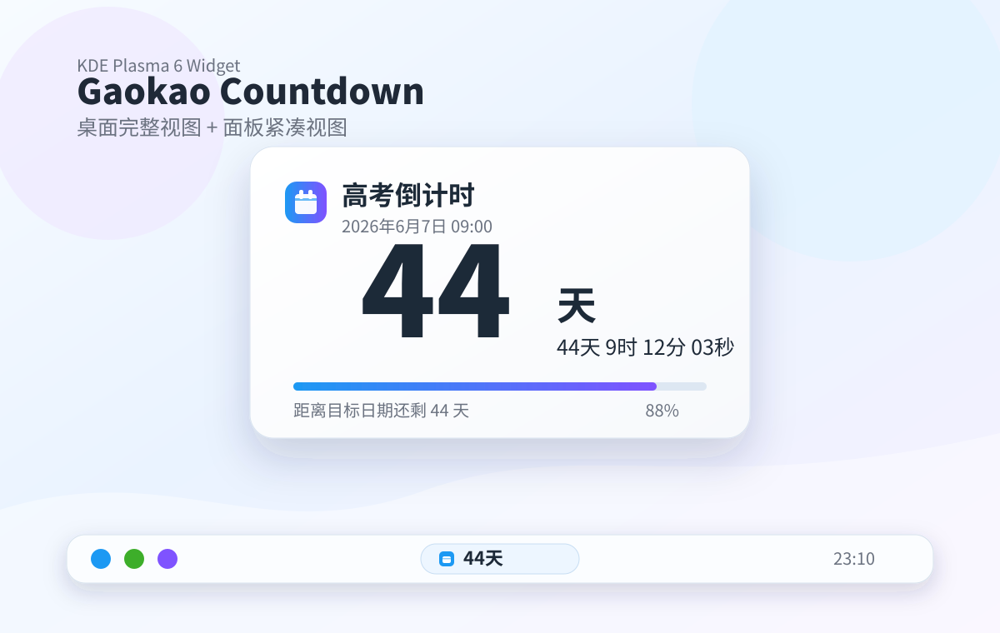

# 高考倒计时

<p align="center">
  
  
  
</p>

一个为 KDE Plasma 6 桌面和面板准备的高考倒计时小组件。默认目标时间为每年 **6 月 7 日 09:00**，也可以在小组件设置里改成自己的考试、截止日或纪念日。

<p align="center">
  
</p>

## 亮点

- **Plasma 6 原生结构**：使用 `metadata.json`、`PlasmoidItem` 和 Plasma 6 QML API。
- **桌面/面板都好用**：桌面显示完整倒计时卡片，面板显示紧凑天数，点击可展开完整视图。
- **日期计算稳妥**：高考当天全天显示“今天”，不会在 6 月 7 日凌晨后误跳到下一年。
- **自动处理闰年**：通过 JavaScript `Date` 计算日期，2 月 29 日等配置会按目标年份自动处理。
- **可配置目标**：支持修改标题、月份、日期、小时、分钟，以及是否显示秒数。
- **自带发布包脚本**：一条命令生成 KDE Store 可上传的 `.plasmoid` 文件。

## 安装

从源码安装到当前用户：

```bash
chmod +x install.sh
./install.sh
```

安装完成后，在桌面右键菜单中选择“添加或管理挂件...”，搜索“高考倒计时”并添加。

如果 Plasma 没有立刻刷新组件列表，可以重启 plasmashell：

```bash
systemctl --user restart plasma-plasmashell.service
```

## 配置

添加小组件后，右键小组件并打开“配置高考倒计时”：

- 标题：例如“高考倒计时”“考研倒计时”“项目截止”
- 日期：目标月份和日期
- 时间：目标小时和分钟
- 秒数：是否在完整视图里显示秒

## 打包发布

生成 KDE Store / 本地安装可用的发布包：

```bash
chmod +x package.sh
./package.sh
```

产物会生成在：

```text
dist/gaokao-countdown.plasmoid
```

用户可以从本地文件安装：

```bash
kpackagetool6 -t Plasma/Applet -i dist/gaokao-countdown.plasmoid
```

KDE Store 上传时使用 `dist/gaokao-countdown.plasmoid` 作为下载文件，`screenshots/preview.png` 可以作为展示截图。

## 开发检查

```bash
kpackagetool6 --appstream-metainfo . --appstream-metainfo-output /tmp/gaokao-countdown.metainfo.xml
appstreamcli validate --no-net /tmp/gaokao-countdown.metainfo.xml
./install.sh
plasmawindowed com.github.plasmoid-gaokao-countdown
```

## 许可

GPL-3.0-or-later
